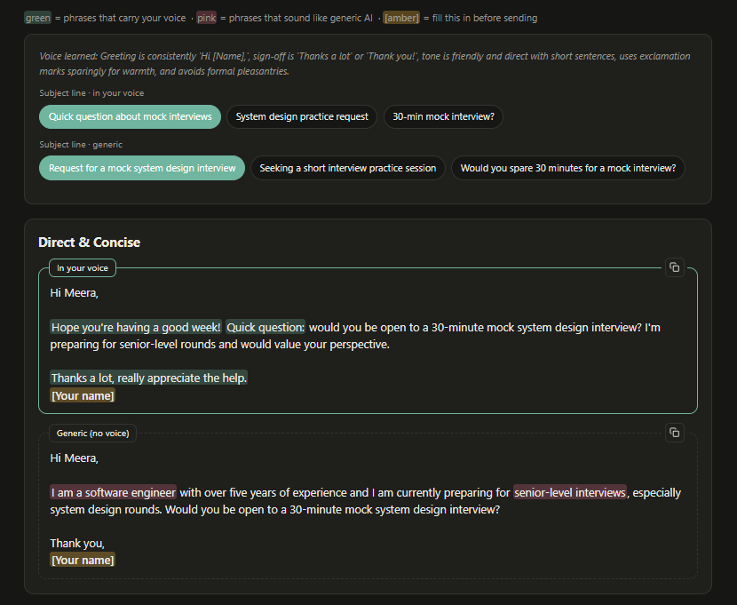
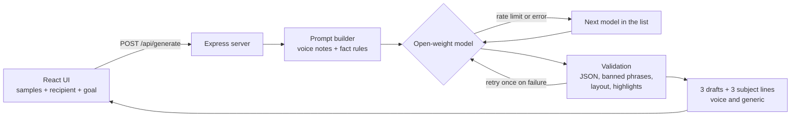

<div align="center">


### Cold emails that sound like you wrote them

Paste a few of your own messages. ColdOpen learns how you write and drafts three cold emails and three subject lines in your voice, then shows you what changed next to a generic AI draft.

<p align="center">
  
  
  
  
  
  
</p>

[**Live demo**](https://coldopen-fe.onrender.com/) · [**Write-up on DEV**](https://dev.to/your-post) · [**Report an issue**](../../issues)



</div>

---

## Motivation

ColdOpen was built for a software engineer with more than five years of experience. Reaching out to someone you do not know is difficult; the first message is often the one that never gets sent. Generic AI email tools produce polished drafts that do not sound like the sender, so those drafts go unsent as well.

ColdOpen begins with the user’s own writing rather than a template.

## Features

| Feature | Description |
|---|---|
| **Voice learning** | Analyzes 2–3 of your own messages and produces a short “voice learned” note (greeting, sign-off, sentence length, habits) that you can review. |
| **Three drafts, three subject lines** | Generates Direct & Concise, Warm & Respectful, and Curiosity-First variants, each written in your voice. |
| **Side-by-side comparison** | Optionally displays the same request written without voice adaptation so you can see the effect of the voice step. |
| **Explainable highlights** | Green marks phrasing that reflects your voice; pink marks stock template phrases in the generic draft; amber marks `[placeholders]` that must be filled before sending. |
| **Fifteen outreach goals** | Covers introductions to alumni, referrals, recruiter outreach, resume feedback, mock interviews, mentoring, follow-ups, thank-you notes, reconnections, references, role switches, and more. |
| **Fact grounding** | The prompt permits only facts you provide. Missing details become `[bracketed placeholders]`. |
| **One-click copy** | Copies the selected subject line and email body together. |

## Architecture



1. **Voice notes first.** The model describes your writing style before drafting, and that description is displayed in the UI.
2. **Fact constraints.** The prompt prohibits invented talks, projects, shared history, or generic praise such as “I admire your work.” Only content from the About you, Your question, and Anything specific fields may be used.
3. **Guardrails.** The server validates JSON, rejects stock clichés in the voice column (for example, “I hope you’re doing well”), repairs single-line emails into a proper layout, and verifies that every highlighted phrase appears in the email.
4. **Model fallback.** Models are tried in order from the configured list. If one is rate-limited or unavailable, the next is used.

## Why open-weight models

- **Swappable.** The model list is a single environment variable. Switching models requires only a configuration change.
- **Inspectable.** Open weights make it possible to distinguish model behavior from application logic. Much of this project consists of guardrails around that boundary.
- **Low cost.** Free-tier access is enough for a weekend of testing.
- **Portable.** The same prompts can later target a local runtime.

**Privacy note:** ColdOpen sends sample messages to a hosted open-weight model to generate drafts. The application does not store them, but they do leave the user’s machine. A fully local mode is on the roadmap and is not yet implemented.

## Tech stack

| Layer | Choice |
|---|---|
| Frontend | React + Vite |
| Backend | Node.js + Express |
| AI | Open-weight models (hosted inference API) |
| Hardening | Input length caps, rate limiting (10 requests per minute per IP), user text fenced as data inside the prompt, JSON validation with retries |
| Hosting | Render (single web service; Express serves the built React app) |

## Getting started

**Requirements:** Node.js 18+ and a free API key from [console.groq.com](https://console.groq.com).

```bash
git clone https://github.com/<your-username>/coldopen.git
cd coldopen

# 1. Backend
cd server
cp .env.example .env        # add your GROQ_API_KEY
npm install
npm run dev                 # http://localhost:5000

# 2. Frontend (new terminal)
cd client
npm install
npm run dev                 # http://localhost:5173
```

Open http://localhost:5173. In development, a **Test data** control above the form can load one of 15 sample cases (one per goal) in a single click. This control is hidden in production builds.

### Environment variables (`server/.env`)

| Variable | Required | Description |
|---|---|---|
| `GROQ_API_KEY` | Yes | API key from console.groq.com |
| `GROQ_MODELS` | No | Comma-separated list of open-weight models, tried in order. Confirm which models your account supports. |
| `PORT` | No | Server port (default `5000`) |
| `CLIENT_ORIGIN` | No | Frontend URL for CORS in production |

## Deploy on Render

A single web service is sufficient because Express serves the built frontend.

| Setting | Value |
|---|---|
| Build command | `cd client && npm install && npm run build && cd ../server && npm install` |
| Start command | `node server/index.js` |
| Environment | `GROQ_API_KEY`, `GROQ_MODELS` |

## API

**`POST /api/generate`**

```json
{
  "writingSamples": "2-3 of your own messages (80+ characters)",
  "recipientName": "Priya Sharma",
  "recipientRole": "Engineering Manager",
  "company": "Example Corp",
  "goal": "switch",
  "length": 100,
  "about": "Software engineer, 5+ years, backend work",
  "ask": "How does your team hire for senior roles?",
  "context": "We were in the same college tech club",
  "compare": true
}
```

Returns `{ personalized, generic }`. Each object contains `voice_notes`, three `subject_lines`, and three `variants` (`tone`, `body`, `highlights`). `generic` is `null` unless `compare` is `true`.

**`GET /api/health`** returns the configured model list.

## Project structure

```
coldopen/
├── server/
│   ├── index.js          # API, prompt builder, guardrails, highlights
│   ├── package.json
│   └── .env.example
└── client/
    ├── src/
    │   ├── App.jsx       # form, results, highlighting
    │   ├── testData.json # 15 one-click test cases (dev only)
    │   └── styles.css
    └── vite.config.js    # proxies /api to the server in development
```

## Limitations

- Language models may occasionally introduce small details not present in the input. Fact rules and filters reduce this risk but do not eliminate it. **Review every draft before sending.**
- Voice match quality depends on the amount and naturalness of the writing samples provided.
- Highlights are guidance, not a quantitative measure. Green and pink markers combine model suggestions with simple fallbacks (overlap with samples and a curated list of stock phrases). They are not an AI-text detector.
- Free-tier rate limits apply. A request with generic comparison enabled makes two model calls.

## Roadmap

- [x] Local mode so samples never leave the device
- [x] Support for additional open-weight models, with side-by-side voice comparison
- [x] Persist writing samples in the browser to avoid re-pasting
- [x] “Make it shorter / more casual” controls per email
- [ ] Highlight facts in a draft that were not present in the input

## Contributing

Issues and pull requests are welcome. For changes larger than a small fix, open an issue first to agree on the approach. Do not commit API keys: `.env` is gitignored, and `.env.example` documents the required variables.

## Acknowledgements

Built over a weekend for the [Hacktoberfest 2026 Weekend Challenge: Build for a Friend](https://dev.to/challenges/hacktoberfest-weekend-2026-10-01). Thanks to the open-weight model community and to the free tiers that made development free.

## License

[MIT](LICENSE)
